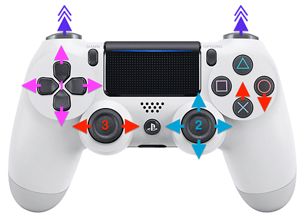

# Zero Ones Given Bluetooth remote controlled robot

- Clone the project with submodules: `git clone --recurse-submodules git@github.com:zero-ones-given/bluetooth-gamepad-robot-firmware.git`
- Install [ESP-IDF 5.4](https://docs.espressif.com/projects/esp-idf/en/v5.4.3/esp32/get-started/index.html)
- Configure python virtual env etc by running: `. $HOME/esp/esp-idf/export.sh`
- Build `idf.py build`
- Flash and monitor: `idf.py -p /dev/cu.usbserial-0001 flash monitor` (replace the port with the appropriate one, see [establishing a serial connection](https://docs.espressif.com/projects/esp-idf/en/v5.4.3/esp32/get-started/establish-serial-connection.html))
- See [pairing instructions for your controller](https://bluepad32.readthedocs.io/en/stable/supported_gamepads/)
    - You can pair most controllers without manually configuring mac addresses. However, If you're using a *DS3 controller*, find out the bluetooth mac address (should be printed out to console during startup) and use [sixaxispairer](https://github.com/user-none/sixaxispairer) or some other tool to write the mac address to the controller
    - `./bin/sixaxispairing xx:xx:xx:xx:xx:xx`

## Common issues and how to fix them
- If you get build errors after changing ESP-IDF version, try running `idf.py fullclean` and building again.
- If you did not use `--recurse-submodules` when you cloned the repo the build will fail. This can be fixed by pulling submodules.
- If the submodules have been updated to a newer version since you cloned the repository, you may need to run `git submodule update`.
- Sometimes pressing the the EN button on the ESP32 dev board to enable programming mode is required before flashing
- Multiple controllers can connect to the same robot at the same time. Ensure you have set `CONFIG_BLUEPAD32_MAX_DEVICES=1` in your sdkconfig and rebuild. This has been configured in [sdkconfig.defaults](sdkconfig.defaults) on line 50, but that will not be reflected in your sdkconfig if you built this project before that change was made. Alternatively you can also back up and delete your sdkconfig. During the next build it will be generated based on sdkconfig.defaults.

## Controls
There are multiple ways to control the robot and they can be mixed to find an optimal driving style.



1) You can use the dpad / arrow keys to turn and move the robot.
2) You can use the right analog stick to turn and move the robot. The left analog stick is reserved only for turning / steering.
3) Inspired by driving games, you can use the X / A button to accelerate and Square / B button to reverse, while steering with the left analog stick. (On some controllers the accelerate and reverse buttons may be the other way around)

Pressing a shoulder button (L1 or R1) while moving forward boosts the speed for a moment. The boost can be used again after a 4-5 second cooldown.

## Calibrating

If the robot does not drive straight, you can hold the `start` / `home` / `options` button while pressing `left` or `right` on the dpad. This compensates the balance of the motors to favor the direction you pressed. The maximum compensation is reached after 10 button presses. This setting does not persist after a restart.

You can reset the motor balance by holding the `start` / `home` / `options` button and pressing `up` or `down` on the dpad.

## Development
This firmware uses the Bluepad32 Arduino template for ESP-IDF. You can find the code handling controller input and controlling the motors in [main/sketch.cpp](main/sketch.cpp).

---

> [!NOTE]
> You should find everything you need to flash and start using your [Micro Invaders robot](https://github.com/robot-uprising-hq/ai-robot-hardware) above. You can find the original readme of the template project below:


# ESP-IDF + Arduino + Bluepad32 template app

[](https://discord.gg/r5aMn6Cw5q)


This is a template application to be used
with [Espressif IoT Development Framework](https://github.com/espressif/esp-idf).

Please check [ESP-IDF docs](https://docs.espressif.com/projects/esp-idf/en/latest/get-started/index.html) for getting
started instructions.

Requires ESP-IDF **v5.4.2**.

Includes the following ESP-IDF components, with a pre-configured `sdkconfig` file:

* [Arduino Core for ESP32](https://github.com/espressif/arduino-esp32) component
* [Bluepad32](https://github.com/ricardoquesada/bluepad32/) component
* [BTStack](https://github.com/bluekitchen/btstack) component

## How to compile it

Clone the template project:

   ```sh
   git clone --recursive https://github.com/ricardoquesada/esp-idf-arduino-bluepad32-template.git my_project
   ```

After cloning the *template* you have the following options:

* A) Using PlatformIO
* B) Visual Studio Code + ESP-IDF plugin
* C) CLion (personal favorite)
* D) ESP-IDF from command line

*Note: Arduino IDE is not supported in this "template app" project*

### A) Using PlatformIO + ESP-IDF

![open_project][pio_open_project]

1. Open Visual Studio Code, select the PlatformIO plugin
2. Click on "Pick a folder", and select the recently cloned "my_project" folder

That's it. The PlatformIO will download the ESP-IDF toolchain and its dependencies.

It might take a few minutes to download all dependencies. Be patient.

*Note: You might need to remove previously installed PlatformIO packages. Just do `rm -rf ~/.platformio`
and reinstall the PlatformIO plugin.*

![build_project][pio_build_project]

After all dependencies were installed:

1. Click on one of the pre-created boards, like *esp32-s3-devkit-1*. Or edit `platformio.ini` file, and add your own.
2. Click on *build*

![monitor_project][pio_monitor_project]

Finally, click on "Upload and Monitor":

* It will upload your sketch
* And will enter into "monitor" mode: You can see and use the console. Try typing `help` on the console.

Further reading: [PlatformIO Espressif IoT Development Framework][pio_espidf]

[pio_open_project]: https://lh3.googleusercontent.com/pw/ABLVV85JEEjjsQqcCcfZUclYF1ItYSHPmpzP0SC4VH9Ypqp05r2ixlv9C2xv4p-r6fW_CyCNa8ylmeSjyUg_K2Sp-XUXQRTYO_6HvhQXcXxTZXgQvvNBqA8JaerwCB1UODkXgYa_6ONT19KTO52OMs0eOOeeMg=-no-gm?authuser=0

[pio_build_project]: https://lh3.googleusercontent.com/pw/ABLVV86DiV9H-wDEv1X8ra_fJAw0OG2sBoM5d0gJElPfptzVpb6n8gzOEHDfKXLMKrivzNSt03XpMWSw-hSVJUi0aavQiwgL0t1rmQeKqfYpXkGCKKwcerrNx8BBkFR3VoKQEPMF-e-xVvKVque2pi1sTa8tWA=-no-gm?authuser=0

[pio_monitor_project]: https://lh3.googleusercontent.com/pw/ABLVV845uPqRtJkUrv4JlODuTr7Shnw0HR7BdojRbxv3xWyiUO-V_Kv42YAKAV-XyoNRPY5vsyj0yRDsRxH0mxz8Q1NYzvhCKw5Ni9MH6UYR8IiaT8XS9hysR81APn8X2tnVgnmJ6ZkSPCgUURnE2MVYIWYrNQ=-no-gm?authuser=0

[pio_espidf]: https://docs.platformio.org/en/latest/frameworks/espidf.html

### B) Visual Studio Code + ESP-IDF plugin


Open [Visual Studio Code][vscode] and install the [ESP-IDF plugin][esp-idf-plugin].

Features:

* All the regular Visual Studio Code regular features
* ...plus configure, build, flash and monitor your project
* ...and much more

[vscode]: https://code.visualstudio.com/

[esp-idf-plugin]: https://github.com/espressif/vscode-esp-idf-extension

### C) CLion


[CLion][clion] is a great IDE, and my personal favorite. It works very well with ESP-IDF based projects.

To integrate your project with CLion, follow the steps in the [CLion official documentation][clion_esp_idf].

[clion]: https://www.jetbrains.com/clion/

[clion_esp_idf]: https://www.jetbrains.com/help/clion/esp-idf.html

### D) ESP-IDF from command line

#### For Windows

1. Install [ESP-IDF v5.4][esp-idf-windows-installer]. For further info,
   read: [ESP-IDF Getting Started for Windows][esp-idf-windows-setup]

    * Either the Online or Offline version should work
    * When asked which components to install, don't change anything. Default options are Ok.
    * When asked whether ESP can modify the system, answer "Yes"

2. Launch the "ESP-IDF v5.4 CMD" (type that in the Windows search box)

3. Compile it

    ```sh
    # Compile it
    cd my_project
    idf.py build

    # Flash + open debug terminal
    idf.py flash monitor
    ```

[esp-idf-windows-setup]: https://docs.espressif.com/projects/esp-idf/en/latest/esp32/get-started/windows-setup.html

[esp-idf-windows-installer]: https://dl.espressif.com/dl/esp-idf/?idf=5.4

#### For Linux / macOS

1. Requirements and permissions

   Install ESP-IDF dependencies (taken from [here][toolchain-deps]):

    ```sh
    # For Ubuntu / Debian
    sudo apt-get install git wget flex bison gperf python3 python3-pip python3-setuptools cmake ninja-build ccache libffi-dev libssl-dev dfu-util libusb-1.0-0
    ```

   And in case you don't have permissions to open `/dev/ttyUSB0`, do:
   (taken from [here][ttyusb0])

    ```sh
    # You MUST logout/login (or in some cases reboot Linux) after running this command
    sudo usermod -a -G dialout $USER
    ```

2. Install and setup ESP-IDF

    ```sh
    # Needs to be done just once
    # Clone the ESP-IDF git repo
    mkdir ~/esp && cd ~/esp
    git clone -b release/v5.4 --recursive https://github.com/espressif/esp-idf.git

    # Then install the toolchain
    cd ~/esp/esp-idf
    ./install.sh
    ```

3. Compile the template

   Clone the template:

    ```sh
    # Do it everytime you want to start a new project
    # Clone the template somewhere
    mkdir ~/src && cd ~/src
    git clone --recursive https://github.com/ricardoquesada/esp-idf-arduino-bluepad32-template.git my_project
    ```

   Export the ESP-IDF environment variables in your shell:

    ```sh
    # Do it everytime you open a new shell
    # Optional: add it in your ~/.bashrc or ~/.profile
    source ~/esp/esp-idf/export.sh
    ```

   And finally compile and install your project.

    ```sh
    # Compile it
    cd ~/src/my_project
    idf.py build

    # Flash + open debug terminal
    idf.py flash monitor
    ```

[toolchain-deps]: https://docs.espressif.com/projects/esp-idf/en/latest/esp32/get-started/linux-setup.html

[ttyusb0]: https://docs.espressif.com/projects/esp-idf/en/latest/esp32/get-started/establish-serial-connection.html#linux-dialout-group

## Using 3rd party Arduino libraries

To include 3rd party Arduino libraries in your project, you have to:

* Add them to the `components` folder.
* Add `CMakeLists.txt` file inside the component's folder

Let's use a real case as an example:

### Example: Adding ESP32Servo

Suppose you want to use [ESP32Servo] project. The first thing to notice is that the source files are placed
in the `src` folder. We have to create a `CMakeLists.txt` file that tells ESP-IDF to look for the sources
in the `src` folder.

Example:

```sh
# 1) We clone ESP32Servo into components folder
cd components
git clone https://github.com/madhephaestus/ESP32Servo.git
cd ESP32Servo
```

And now create these files inside `components/ESP32Servo` folder:

```sh
# 2) Create CMakeLists.txt file
# Copy & paste the following lines to the terminal:
cat << EOF > CMakeLists.txt
idf_component_register(SRC_DIRS "src"
                    INCLUDE_DIRS "src"
                    REQUIRES "arduino")
EOF
```

Finally, update the dependencies in the `main/CMakeLists.txt`. E.g:

```sh
cd main
edit CMakeLists.txt
```

...and append `ESP32Servo` to `REQUIRES`. The `main/CMakeLists.txt` should look like this:

```cmake
idf_component_register(SRCS "${srcs}"
        INCLUDE_DIRS "."
        REQUIRES "${requires}" "ESP32Servo")
```

And that's it. Now you can include `ESP32Servo` from your code. E.g:

```cpp
// Add this include in your arduino_main.cpp file
#include <ESP32Servo.h>
```

[esp32servo]: https://github.com/madhephaestus/ESP32Servo.git

## Further info

* [Bluepad32 for Arduino](https://bluepad32.readthedocs.io/en/latest/plat_arduino/)
* [Arduino as ESP-IDF component](https://docs.espressif.com/projects/arduino-esp32/en/latest/esp-idf_component.html)
* [ESP-IDF VSCode plugin](https://docs.espressif.com/projects/esp-idf/en/latest/esp32/get-started/vscode-setup.html)

## Support

* [Discord][discord]: any question? Ask them on our Discord server.

[discord]: https://discord.gg/r5aMn6Cw5q
